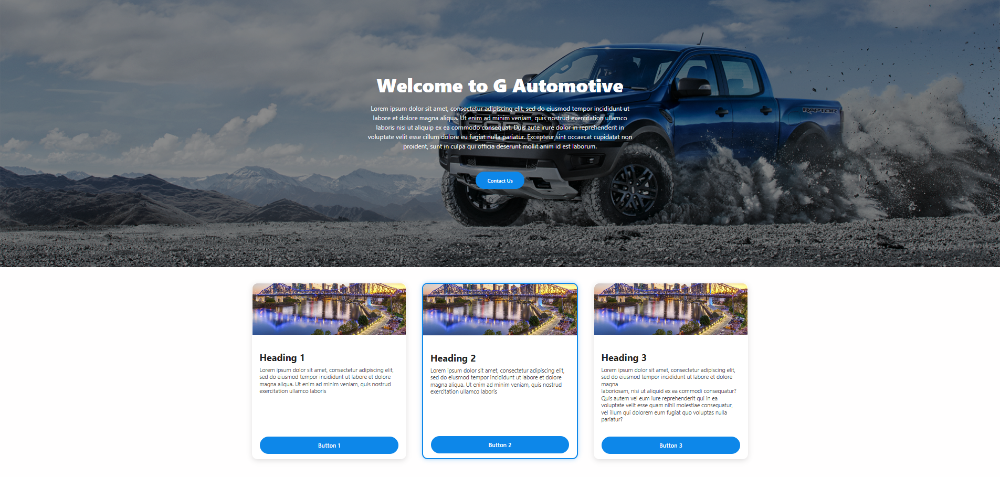
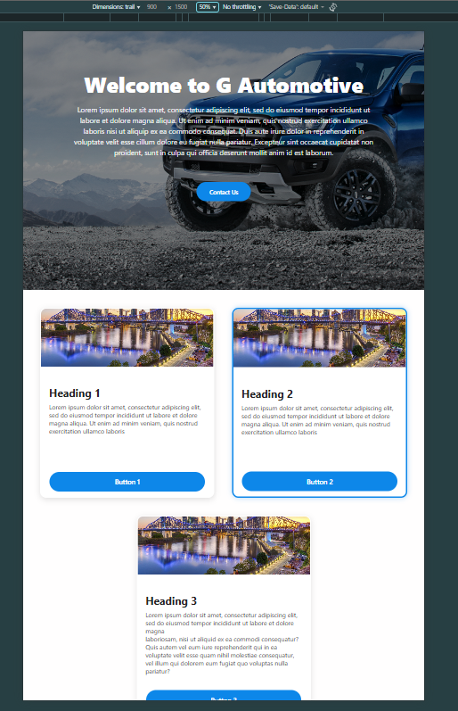
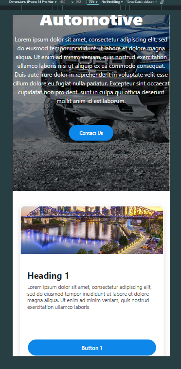

# 
This project is a small React application built from a design temple provide by Tom lynch via email.
The goal was to recreate the banner section and a set of three cards as closely as possible to the mockup, while keeping the code clean, reusable, and responsive.
Tech stake 
React (Vite) – fast setup
React using javascript
Header.jsx / Header.scss
These files contain the header component and all styling for the hero section, including the background image,dark overlay, main heading, subheading, and header button.
Card.jsx / Card.scss
These files contain the card component and its subcomponents (image, header, body text, and button), along with all the related styles.
The selected card border highlighting is also handled here.
cardStrings.js
This file stores the main text strings used for the card titles and body content. Keeping text separate makes the components cleaner and easier to reuse.

Photos
Screenshot taken in Chrome on a 1920×1080 monitor.

Tablet view 

Mobile View 

Temple Project Brief:

We would like you to deploy the React page as a website. We would suggest using something quick like CodeSandbox, Vercel or Github pages. However, any way you prefer to launch a website will be fine.

Build the Project using React ( or Next JS )

Use SCSS (preferably) or CSS for the styling

Use of components, e.g, the card should be made with components such as Card, CardImage, CardHeader, CardBody, Button. Please do not use ANY component libraries or packages like MUI or ANT design. We want to see you are able to build these components yourself.

It should be responsive, and look good on desktop and mobile, the cards should be in a single column on mobile.

Card 3 needs to have 2 paragraphs of text in it so it's higher than the other cards

We are looking for attention to detail, padding, border radius, box shadow, overlays, alignment as per the design.

We want to see some sort of state management being used, we would suggest on the border. On load, the middle card should have a border, when you click a cards button, the border should switch to that card that was clicked, but always be on the middle card on load.

Push code to your Github, Gitlab or Bitbucket account so we can view the code

